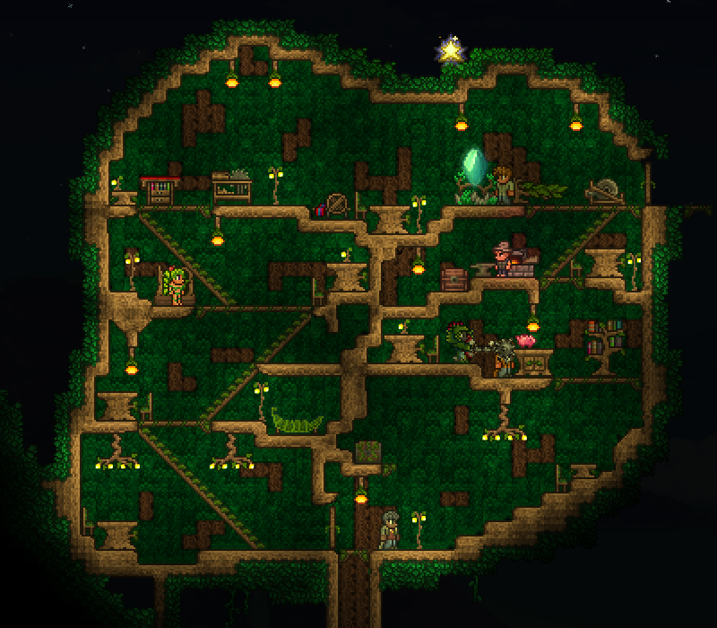
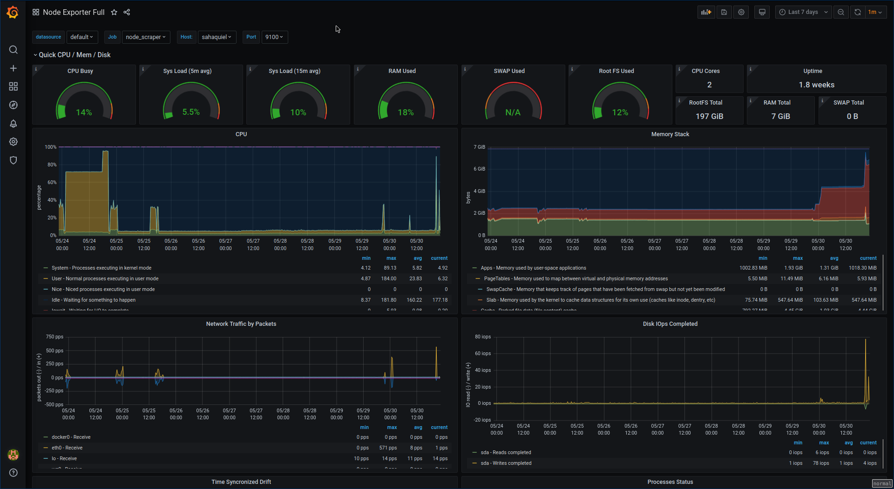

# flowercluster.io

my digital garden

## running services
* [terraria 1.4.0.4](https://terraria.org/)


* [prometheus / grafana](https://prometheus.io/docs/visualization/grafana/)


## tools
built with:
* [nixos](https://nixos.org/nixos)
* [krops](https://cgit.krebsco.de/krops/about/)
* [stack](https://docs.haskellstack.org/en/stable/README/) + [shake](https://shakebuild.com/)
* [terraform](https://www.terraform.io/)

## deploying
to deploy:
``` sh
$(nix-build ./deploy.nix -A sahaquiel)
```
## notes
* `shake` build system is outdated for now.

---

## old build system
flowercluster uses shake for a build system. to compile the build system:

```sh
stack build
```
to build flowercluster:
``` sh
stack build && \
  stack exec -- grow build
```

## old build system motivation
The Grow module compiles to a build system used to maintain flowercluster, a
digital garden.

The build system manages tasks such as:

  * building infrastructure from Terraform modules,
  * parsing Terraform output files,
  * building AMI images from Packer templates,
  * parsing Packer manifest files.

Why maintain this complex build system?

  * Builds are reproducible: build artifacts can be reconstructed and updated
  * Builds are safe: each action in a build rule is typed
  * Builds are composable: complex build actions are defined by combining
    smaller actions
  * Builds are extensible: the build system is a Haskell library
